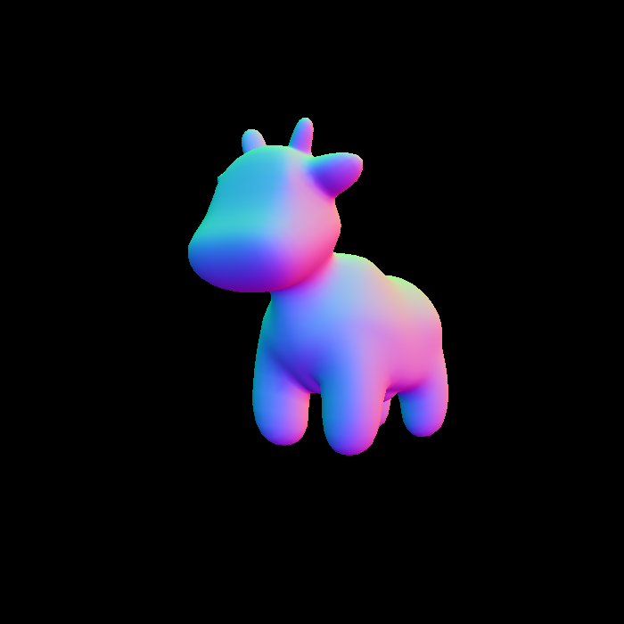
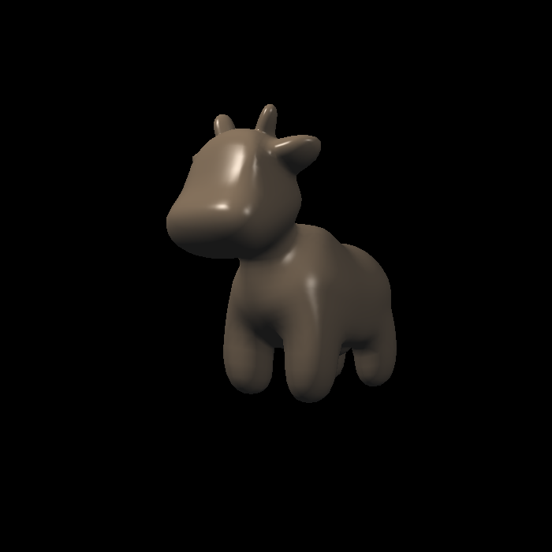
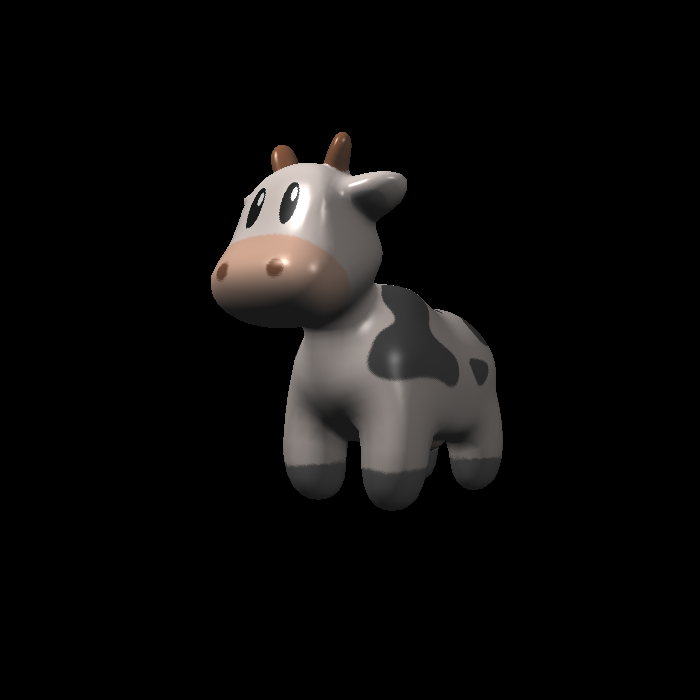
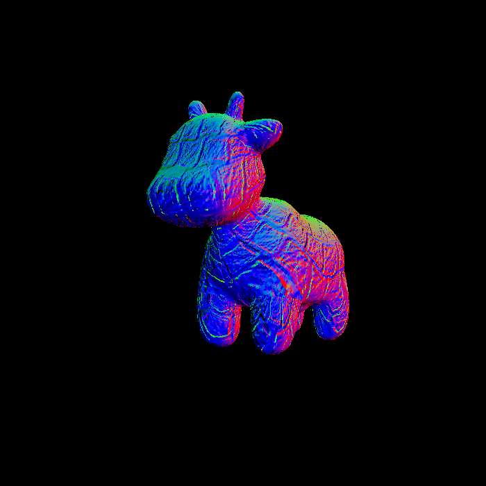
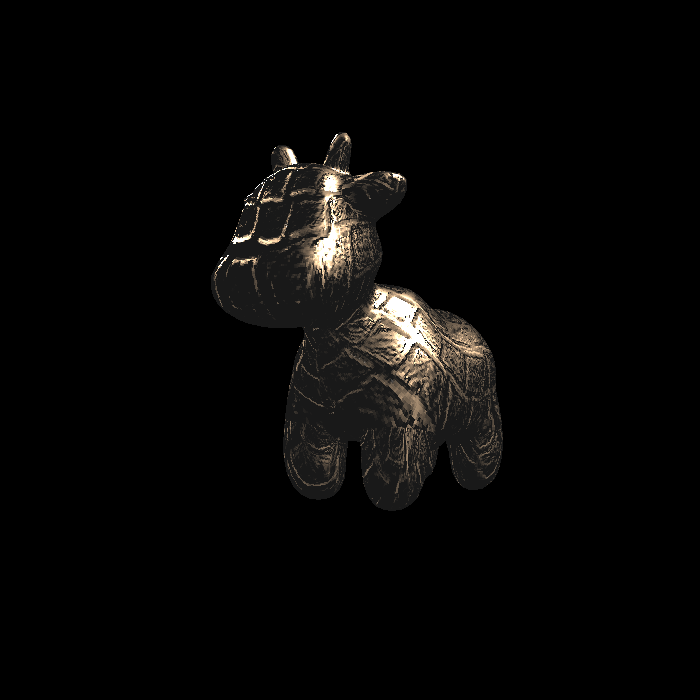

[toc]

## Summary

* [5 分] 提交格式正确，包括所有需要的文件。代码可以正常编译、执行。 

> 完成。

* [10 分] 参数插值: 正确插值颜色、法向量、纹理坐标、位置 (Shading Position) 并将它们传递给 fragment_shader_payload. 

> 完成。
>
> 

* [20 分]Blinn-phong 反射模型: 正确实现 phong_fragment_shader 对应的 反射模型。 

> 完成。需要手动实现Blinn-Phong反射模型公式。
>
> 

* [5 分] Texture mapping: 将 phong_fragment_shader 的代码拷贝到 texture_fragment_shader, 在此基础上正确实现 Texture Mapping. 

> 完成。这里就是将颜色kd替换为从texture中得到的颜色，然后使用Blinn-Phong模型去光栅化。
>
> 

* [10 分] Bump mapping 与 Displacement mapping: 正确实现 Bump mapping 与 Displacement mapping. 

> 跟着提示完成。
>
> 
>
> 

* [Bonus 3 分] 尝试更多模型: 找到其他可用的.obj 文件，提交渲染结果并 把模型保存在 /models 目录下。这些模型也应该包含 Vertex Normal 信息。 

> 未完成。

* [Bonus 5 分] 双线性纹理插值: 使用双线性插值进行纹理采样, 在 Texture 类中实现一个新方法 Vector3f getColorBilinear(float u, float v) 并 通过 fragment shader 调用它。为了使双线性插值的效果更加明显，你应该 考虑选择更小的纹理图。请同时提交纹理插值与双线性纹理插值的结果，并 进行比较。

> 未完成。

