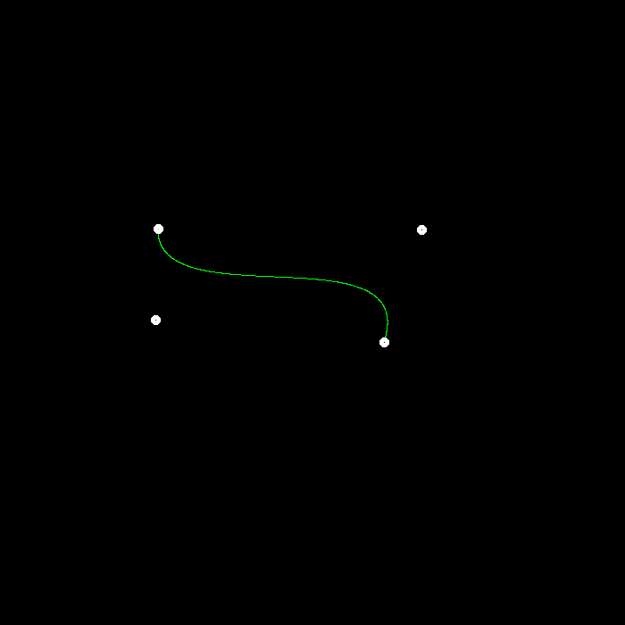
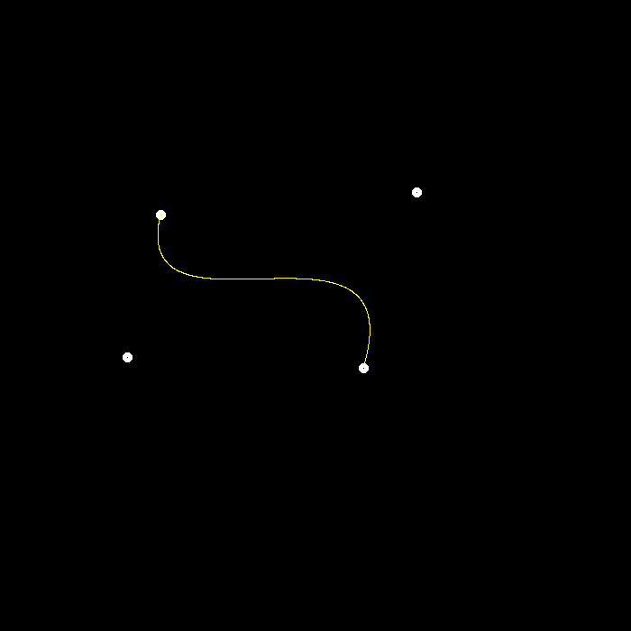
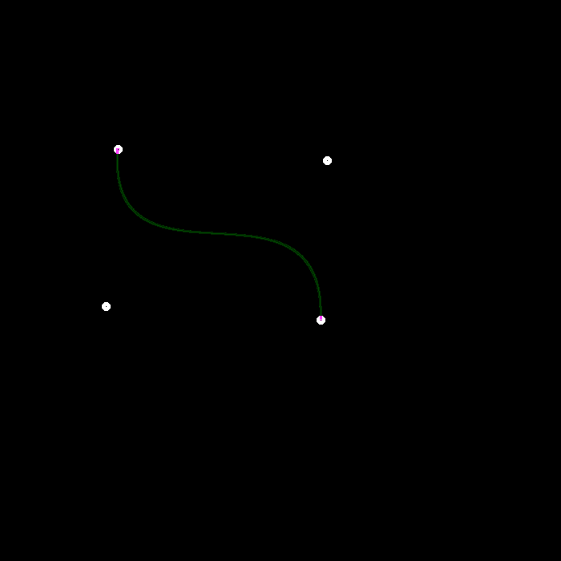

# Homework 4

## Summary

* [5 分] 提交的格式正确，包含所有必须的文件。代码可以编译和运行。 

> 完成。

* [20 分] De Casteljau 算法： 对于给定的控制点，你的代码能够产生正确的 Bézier 曲线。 

> 完成。
>
> 原始实现（绿色线条）：
>
> 
>
> 和代码已给的native实现放一起（黄色线条）：
>
> 

* [5 分] 奖励分数： 实现对 Bézier 曲线的反走样。(对于一个曲线上的点，不只把它对应于一个像 素，你需要根据到像素中心的距离来考虑与它相邻的像素的颜色。)

>尝试进行反走样，颜色有点暗（按距离进行幂次颜色衰减）：
>
>

## 代码实现

```cpp
cv::Point2f recursive_bezier(const std::vector<cv::Point2f> &control_points, float t) 
{
    // TODO: Implement de Casteljau's algorithm
    if (control_points.size() == 4)
    {
        auto &p_0 = control_points[0];
        auto &p_1 = control_points[1];
        auto &p_2 = control_points[2];
        auto &p_3 = control_points[3];
        
        auto point = std::pow(1 - t, 3) * p_0 + 3 * t * std::pow(1 - t, 2) * p_1 +
                 3 * std::pow(t, 2) * (1 - t) * p_2 + std::pow(t, 3) * p_3;
        return point;
    }
    else
    {
        std::vector<cv::Point2f> points;
        for (int i = 1; i < control_points.size(); ++i)
        {
            points.push_back(cv::Point2f((1-t) * control_points[i-1] + t * control_points[i]));
        }
        return recursive_bezier(points, t);
    }
}

void bezier(const std::vector<cv::Point2f> &control_points, cv::Mat &window) 
{
    // TODO: Iterate through all t = 0 to t = 1 with small steps, and call de Casteljau's 
    // recursive Bezier algorithm.
    const float step = 0.001;

    for (float t = 0; t <= 1; t += step)
    {
        auto point = recursive_bezier(control_points, t);

        if (true)// anti-aliasing
        {
            for (float i = point.x-1; i <= point.x+1; ++i)
            {
                for (float j = point.y-1; j <= point.y+1; ++j)
                {
                    float distance = std::sqrt(std::pow(point.x - i, 2) + std::pow(point.y - j, 2)) / 3; // 到中心点的距离为0-2*1.414不等，压缩到1以内
                    window.at<cv::Vec3b>(j, i)[1] = 255 * std::pow(1-distance, 3); // 越接近越绿，原点最绿，周围迅速变浅(幂运算加快衰减速度)
                }
            }
        }
        else
        {
            window.at<cv::Vec3b>(point.y, point.x)[1] = 255;
        }
    }
}
```

