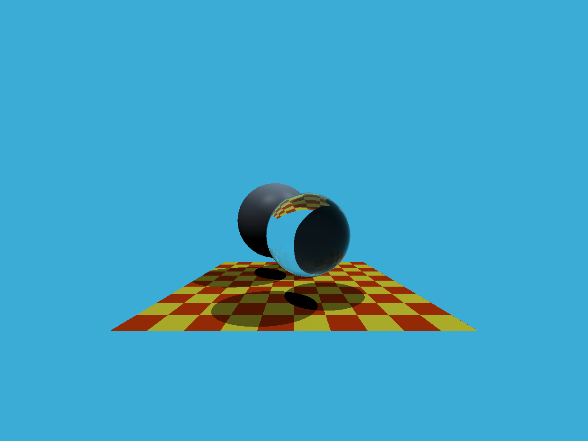

# Homework5

[toc]

## Summary

* [5 分] 提交的格式正确，包含所有必须的文件。代码可以编译和运行。 

> 完成。

* [10 分] 光线生成： 正确实现光线生成部分，并且能够看到图像中的两个球体。 

> 完成。

* [15 分] 光线与三角形相交： 正确实现了 Moller-Trumbore 算法，并且能够看到图像中的地面。

> 完成。
>
> 

## Code

###  `void Renderer::Render(const Scene& scene)`

```cpp
void Renderer::Render(const Scene& scene)
{
    std::vector<Vector3f> framebuffer(scene.width * scene.height);

    float scale = std::tan(deg2rad(scene.fov * 0.5f));
    float imageAspectRatio = scene.width / (float)scene.height;

    // Use this variable as the eye position to start your rays.
    Vector3f eye_pos(0);
    int m = 0;
    for (int j = 0; j < scene.height; ++j)
    {
        for (int i = 0; i < scene.width; ++i)
        {
            // generate primary ray direction
            float x;
            float y;
            // TODO: Find the x and y positions of the current pixel to get the direction
            // vector that passes through it.
            // Also, don't forget to multiply both of them with the variable *scale*, and
            // x (horizontal) variable with the *imageAspectRatio*            
            x = (2 * (float(i) + 0.5) / scene.width - 1) * scale * imageAspectRatio;
            y = (1 - 2 * (float(j) + 0.5) / scene.height) * scale;

            Vector3f dir = normalize(Vector3f(x, y, -1)); // Don't forget to normalize this direction!
            framebuffer[m++] = castRay(eye_pos, dir, scene, 0);
        }
        UpdateProgress(j / (float)scene.height);
    }

    // save framebuffer to file
    FILE* fp = fopen("binary.ppm", "wb");
    (void)fprintf(fp, "P6\n%d %d\n255\n", scene.width, scene.height);
    for (auto i = 0; i < scene.height * scene.width; ++i) {
        static unsigned char color[3];
        color[0] = (char)(255 * clamp(0, 1, framebuffer[i].x));
        color[1] = (char)(255 * clamp(0, 1, framebuffer[i].y));
        color[2] = (char)(255 * clamp(0, 1, framebuffer[i].z));
        fwrite(color, 1, 3, fp);
    }
    fclose(fp);    
}
```

### `bool **rayTriangleIntersect**(const **Vector3f**& v0, const **Vector3f**& v1, const **Vector3f**& v2, const **Vector3f**& orig, const **Vector3f**& dir, float& tnear, float& u, float& v)`

```cpp
bool rayTriangleIntersect(const Vector3f& v0, const Vector3f& v1, const Vector3f& v2, const Vector3f& orig,
                          const Vector3f& dir, float& tnear, float& u, float& v)
{
    // TODO: Implement this function that tests whether the triangle
    // that's specified by v0, v1 and v2 intersects with the ray (whose
    // origin is *orig* and direction is *dir*)
    // Also don't forget to update tnear, u and v.
    Vector3f e1 = v1 - v0;
    Vector3f e2 = v2 - v0;
    Vector3f s = orig - v0;
    Vector3f s1 = crossProduct(dir, e2);
    Vector3f s2 = crossProduct(s, e1);

    float k = 1 / dotProduct(s1, e1);

    tnear = k * dotProduct(s2, e2);
    u = k * dotProduct(s1, s);
    v = k * dotProduct(s2, dir);

    const float ZERO = -0.000001;   // 用来避免浮点数比较由于精度问题造成的误差
    if (tnear > ZERO && u >= ZERO && v >= ZERO && (1-u-v) >= ZERO) // 若重心坐标3个值均非负，说明该点在三角形内；tnear需要>0；使用-E
        return true;
    else
        return false;
}
```

