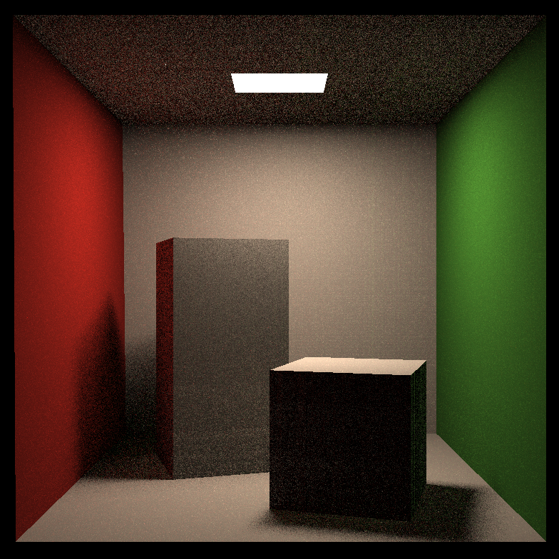
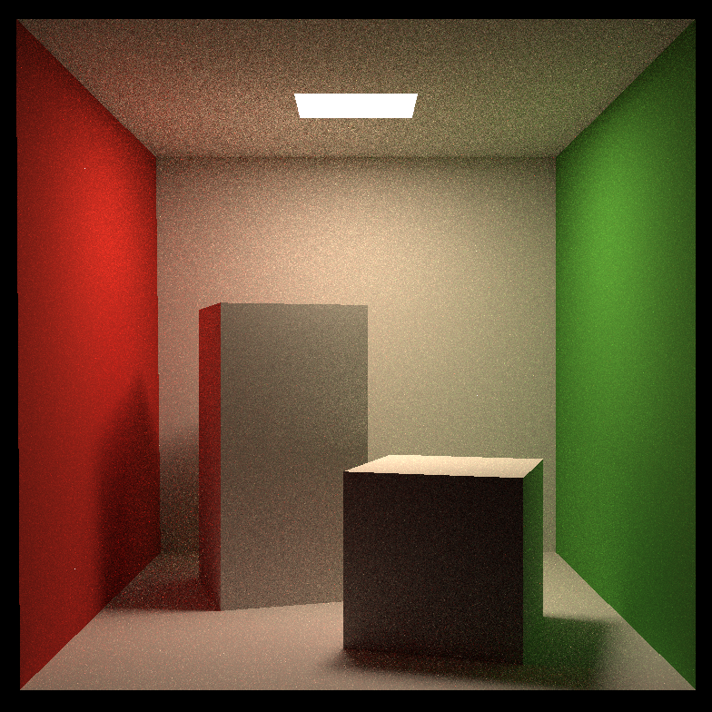

I've finished task ...

## Summary

* [5 points] 提交格式正确，包含所有需要的文件；代码可以在虚拟机下正确 编译运行。 

> 完成。

* [45 points] Path Tracing：正确实现 Path Tracing 算法，并提交分辨率 不小于 512*512，采样数不小于 8 的渲染结果图片。 

> 完成

* [加分项 10 points] 多线程：将多线程应用在 Ray Generation 上，注意 实现时可能涉及的冲突。 

> 完成。

* [加分项 10 points] Microfacet：正确实现 Microfacet 材质，并提交可 体现 Microfacet 性质的渲染结果。

> 未完成。

## Result

* binary_ssp16.png

* binary_ssp64.png

