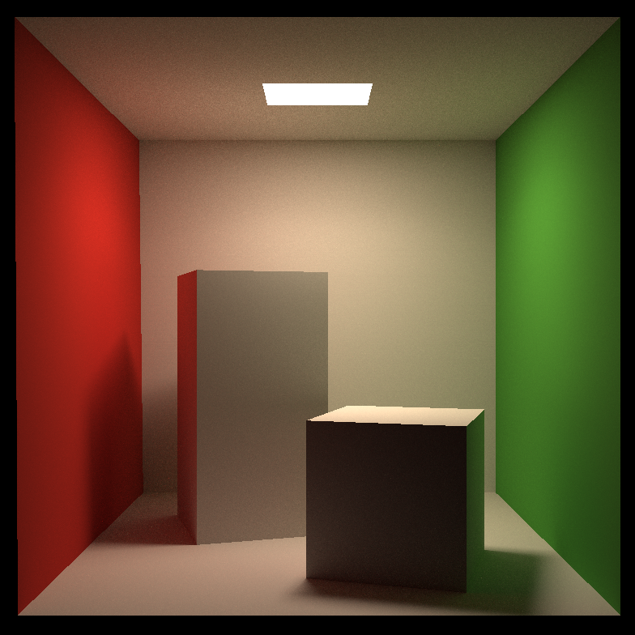
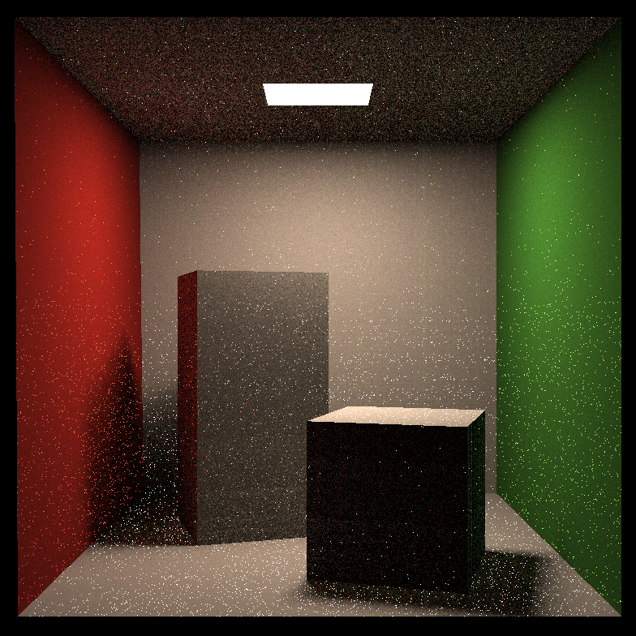
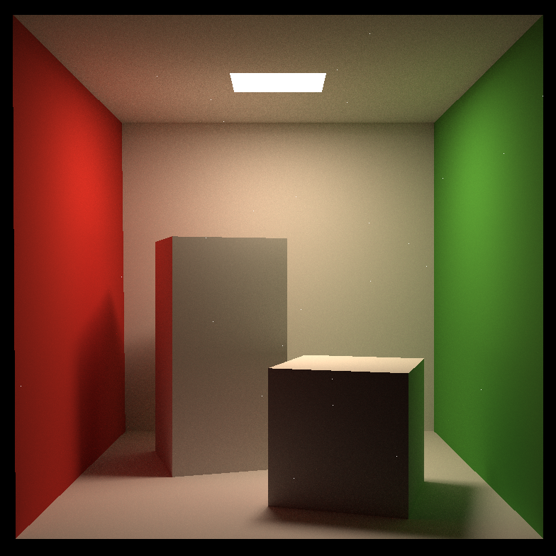

I've finished task ...

## Summary

* [5 points] 提交格式正确，包含所有需要的文件；代码可以在虚拟机下正确 编译运行。 

> 完成。

* [45 points] Path Tracing：正确实现 Path Tracing 算法，并提交分辨率 不小于 512*512，采样数不小于 8 的渲染结果图片。 

> 完成

* [加分项 10 points] 多线程：将多线程应用在 Ray Generation 上，注意 实现时可能涉及的冲突。 

> 完成。

* [加分项 10 points] Microfacet：正确实现 Microfacet 材质，并提交可 体现 Microfacet 性质的渲染结果。

> 未完成。

## Result

* binary_1024.png

## Afterword

1. 对于反射中遇到光源的情况，需要与第一次就遇到光源的情况进行区分。具体到代码中就是`return depth == 0 ? inter_i.m->getEmission() : Vector3f(0);`。如果不这么做，会出现大量的、很明显的噪点，并导致提升ssp数量并不一定能带来画质的提升（可能是降低，因为随着ssp的增加，噪点的影响也更大了）。这个问题修复之前合成的图片如下：（分别对应ssp16和ssp64的情况）

2. ssp提高到1024时，会出现白色噪点。原因是计算物体反射光时的pdf过小导致的。解决办法是加上`pdf_hemi = max(pdf_hemi, EPSILON);`同时，这个EPSILON过大或者过小都不合适，过大会导致画面过于暗淡，过小导致黑色条纹；以及，只能对反射光采取该措施，对于直接光不能这么做。（第一张是改进前，第二张是改进后）

