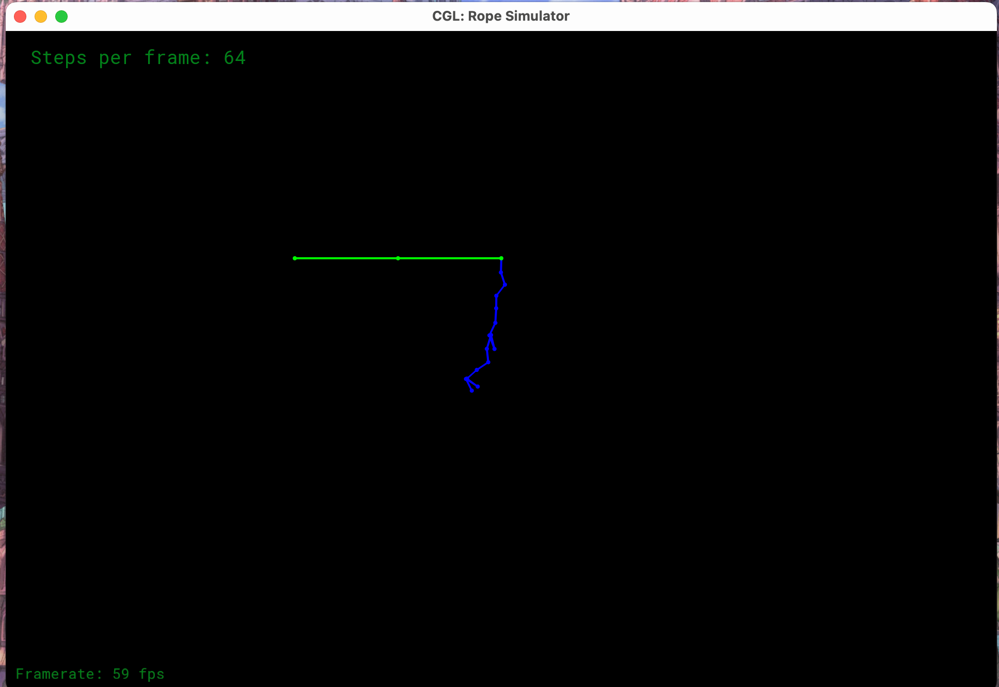
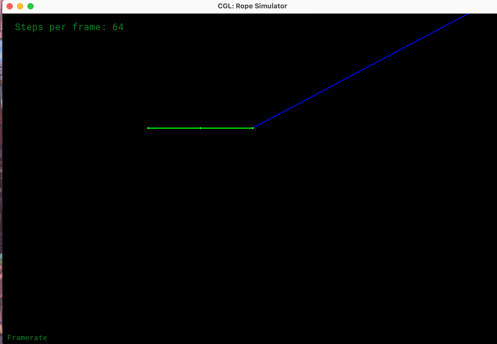
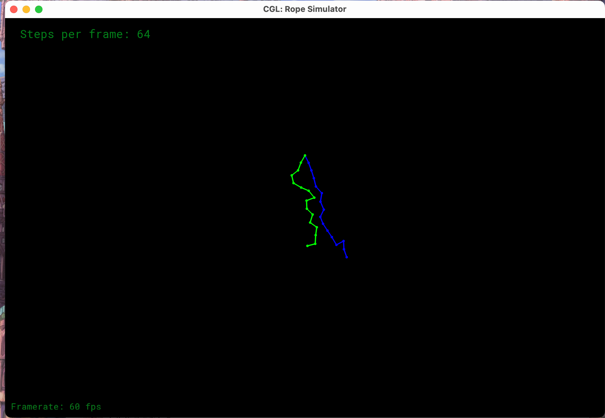
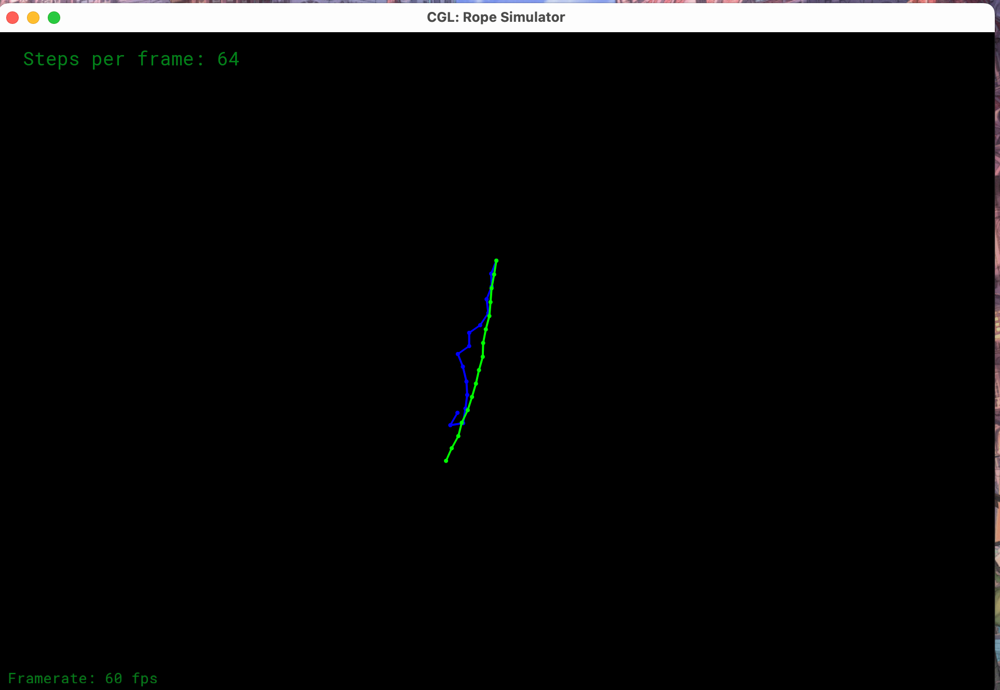
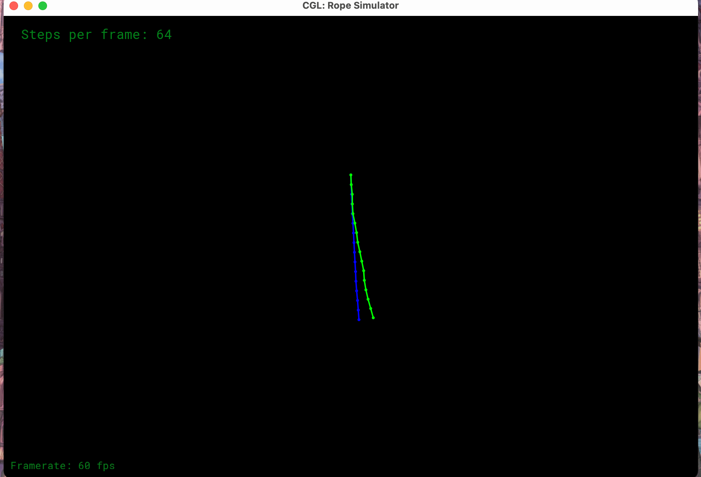

* [5 分] 提交的格式正确，包含所有必须的文件。代码可以编译和运行。 

>完成。

* [5 分] 连接绳子约束，正确的构造绳子 

> 完成。

* [5 分] 半隐式欧拉法 

> For semi-implicit Euler method:
>
> 1. 执行./ropesim，step默认为64， 绳子正常摆了两三下然后开始抽搐
> 2. 执行./ropesim -s 16，从第2下开始有抽搐倾向，第3下开始明显，第4下明显抽搐，第五下开始发癫
> 3. 执行./ropesim -s 256，从第2下开始有抽搐倾向，第3下开始明显，第4下明显抽搐，然后过了一阵子才开始发癫
> 4. 执行./ropesim -s 4096，比较正常的摆了3下，然后开始不稳定
>
> 

* [5 分] 显式欧拉法 

> For explicit Euler method:
>
> 1. 执行./ropesim, step默认为64， 绳子一下子然后甩飞
> 2. 执行./ropesim -s 32， 看不见绳子
> 3. 执行./ropesim -s 128， 绳子多甩了两三下然后甩飞
>
> 

* [10 分] 显式 Verlet 

> For verlet method:
>
> 1. 执行./ropesim，step默认为64， 刚开始与semi-implicit Euler method 得到的结果完全相同，点线竞合，后面开始抽搐就又有了差别（可以看到两根抽搐的线条了）
>
> 

* [5 分] 阻尼

> Add damping_factor:
>
> > 1. 对于semi-implicit Euler method，使用-kd * v作为摩擦力，kd经测试使用0.005比较好，能得到较好的结果。
> > 2. 对于verlet method，使用damping_factor作为阻尼，使用文档提示的0.00005；尝试使用0.005，会过于快速的趋于静止状态，并不好。
>
> 1. 对verlet方法加入了阻尼（damping factor）
>
>     
>
> 2. 对半隐式欧拉法加入了阻尼（用kd * v作为摩擦力）
>
>     

